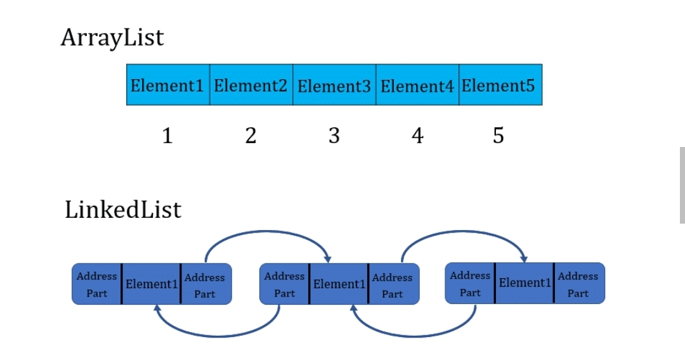
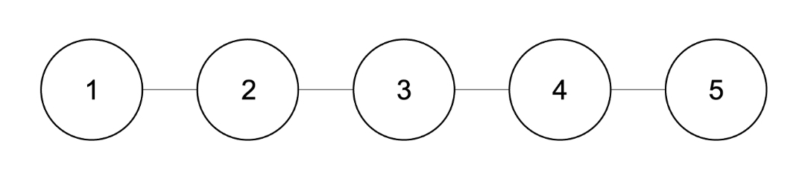

날짜: 2023/01/30
담당자: TPoster
상태: Done
유형: 자료구조

— 차이점

https://javagoal.com/difference-between-arraylist-and-linkedlist/

| 차이점 | ArrayList | LinkedList |
| --- | --- | --- |
| 메모리상에서 데이터 분포 | 연속적 | 불규칙적 |
| 기본 용량 | 10 (에서 동적으로 변화) | 없음 |
| 데이터 접근 방식 | 인덱스로 임의접근 가능 | 리스트 전체 순회 |
| 데이터 구조 | 인덱스에 값 저장 | 노드에 이전/이후 노드 각각의 주소와 값 저장 |
| 성능 | 데이터 접근이 빠름 (인덱스 활용) | 데이터 추가/제거 작업이 빠름 (대상 노드를 가르키는 주소값만 수정) |

++ 공통점

- 둘다 선형 자료구조임 (모든 데이터가 앞이나 뒤로 1:1 관계임)
- 선언과 동시에 용량을 정해야하는 기존의 배열을 대체하기 위한 자료구조임