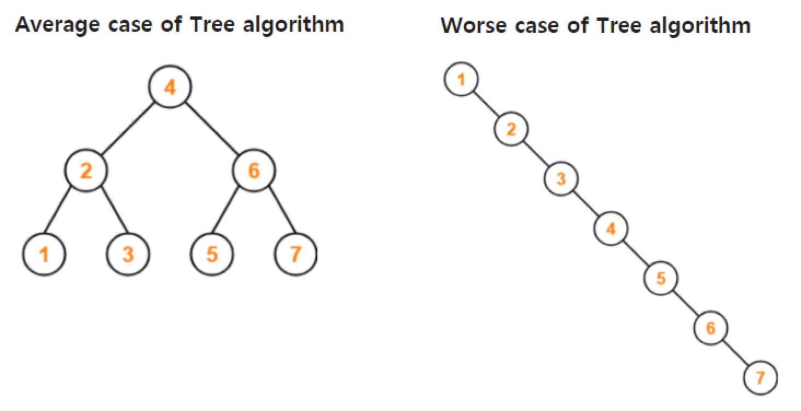
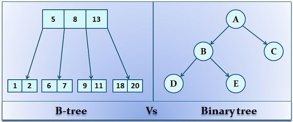
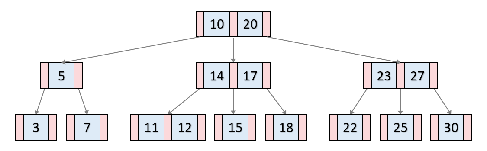
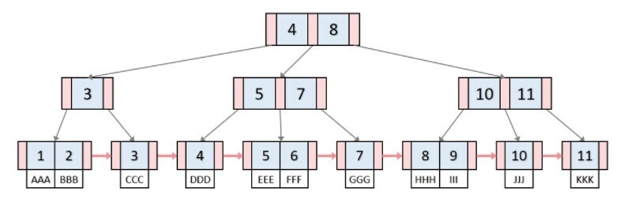

## B 트리란?

### Balanced Tree

- Balanced Tree : 자료의 추가 / 삭제가 발생했을 때 스스로 균형을 유지하는 트리구조
- 이진 트리에서 좌우의 균형이 안 맞는 경우 탐색에 낭비가 발생하기 때문에 사용한다.
    
> 위 그림에서 Balanced tree인 좌측 그림은 데이터 탐색의 시간 복잡도가 O(log n)인데 비해  
우측의 트리 구조에서는 데이터 탐색의 시간 복잡도가 O(n)이 된다.  
    

### B트리 vs. 이진트리

- B 트리와 이진트리의 차이점
    
    B 트리에서는 하나의 노드에 여러 개의 자료가 들어간다.
    
    반면, 이진트리에서는 하나의 노드엔 하나의 자료만 들어간다.  

### 3) 특징

> M차 B트리  
ex) 3차 B트리를 예시로 했을 때 B트리의 특징

- 3차이기 때문에 자식 노드를 최대 3개 까지 가질 수 있다.  
- 항상 정렬된 상태  
- 노드 안에 X개의 데이터가 있다면 자식 노드의 수는 X+1개  
- 자식노드의 데이터는 부모의 데이터에 따라서 배치된다.(부모보다 작으면 왼쪽, 크면 오른쪽)  
- 모든 리프노드의 데이터 수는 2이하(M-1이하)이다.  —> 리프노드 : 자식이 없는 노드.

  

## B 트리 vs B+ 트리

|  | B트리 | B+ 트리 |
| --- | --- | --- |
| 연결리스트 유무 | X | O
→ 전체 데이터를 차례로 처리할 수 있음 |
| 저장 방식 | 각 노드에 key, data 저장 | 각 노드에 key 저장,
data는 리프 노드에만 저장 |
| 부모 key와 리프노드 첫번째 key의 관계 | 부모 key < 리프노드 첫 번째 key | 부모 key ≤ 리프노드 첫 번째 key |

### B트리와 B+트리의 차이점

1. 연결리스트의 유무
    
> B트리는 연결리스트가 없지만 B+트리는 리프노드가 연결리스트를 이룬다.  
따라서 B+트리는 전체 데이터를 차례로 처리가 가능하다.
        
2. key와 data의 저장 방식
    
> B 트리에서는 각 노드에 key와 data를 저장  
B+ 트리에서는 각 노드에 key를 저장하지만 data는 모두 리프노드에 저장되어 있다. 
        
    
3. 부모 key와 리프노트 첫번째 key의 관계
    
> B트리에서는 리프노드의 첫 번째 key는 무조건 부모노드의 key보다 크지만  
B+트리는 삽입 과정에서 리프노드에 있던것이 부모노드로 올라갈 수 있기 때문에  
리프노드의 첫 번째 key가 부모노드의 key보다 크거나 같다.
        

  

4. 저장 방식  

---

**참고 자료**

- B트리
    
    [https://velog.io/@emplam27/자료구조-그림으로-알아보는-B-Tree](https://velog.io/@emplam27/%EC%9E%90%EB%A3%8C%EA%B5%AC%EC%A1%B0-%EA%B7%B8%EB%A6%BC%EC%9C%BC%EB%A1%9C-%EC%95%8C%EC%95%84%EB%B3%B4%EB%8A%94-B-Tree)
    

- B+ 트리
    
    [https://velog.io/@emplam27/자료구조-그림으로-알아보는-B-Plus-Tree](https://velog.io/@emplam27/%EC%9E%90%EB%A3%8C%EA%B5%AC%EC%A1%B0-%EA%B7%B8%EB%A6%BC%EC%9C%BC%EB%A1%9C-%EC%95%8C%EC%95%84%EB%B3%B4%EB%8A%94-B-Plus-Tree)
    

- B트리, B+트리의 자료 추가/삽입
    
    [https://www.youtube.com/watch?v=ysb9BUyVcjw](https://www.youtube.com/watch?v=ysb9BUyVcjw)