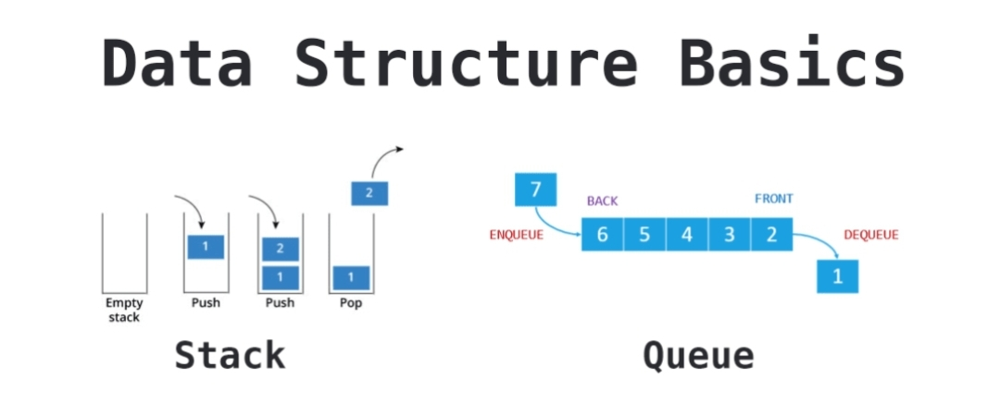

날짜: 2023/01/30
담당자: TPoster
상태: Done
유형: 자료구조

https://velog.io/@sparklingwater/JavaScript-Data-Structures-Stack-vs-Queue

| 차이점 | 스택 | 큐 |
| --- | --- | --- |
| 활용 예시 | 웹페이지 뒤로가기, 실행취소, 프로그램 내 함수 호출 등 후입선출 방식의 작업들 | 프로세스 대기열 관리, 게임 매칭 대기열 등 선입선출 방식의 작업들 |
| 삽입, 삭제 위치 | 일치 (top) | 불일치 (삭제 : front, 삽입 : rear) |
| 데이터 조작을 고려한 최적의 구현방법 | ArrayList 를 활용 - 데이터를 삭제할 때 객체를 제거할 필요가 없음 | LinkedList 를 활용 - 데이터를 삭제할 때, 모든 데이터를 한칸씩 앞당길 필요가 없음 |

기본 개념

- 스택(Stack) : 가장 마지막으로 들어간 데이터가 가장 첫 번째로 나오는 성질을 가진 자료 구조 (LIFO)
- 큐(Queue) : 먼저 들어간 데이터가 먼저 나오는 성질을 가진 자료 구조 (FIFO)