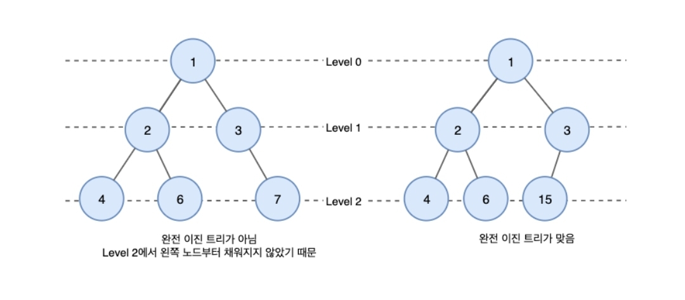
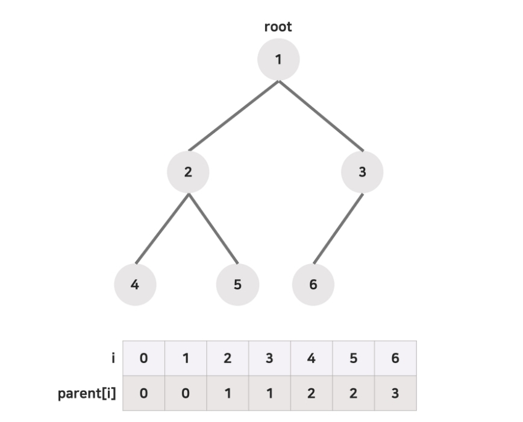

날짜: 2023/01/30
담당자: TPoster
상태: Done
유형: 자료구조

완전이진트리란?

https://velog.io/@hanif/%EC%9E%90%EB%A3%8C%EA%B5%AC%EC%A1%B0-%EC%9D%B4%EC%A7%84-%ED%8A%B8%EB%A6%AC

완전 : 마지막 레벨을 제외한 모든 레벨이 가득찼으며, 마지막 레벨은 왼쪽부터 채워지는

이진 : 자식 노드의 개수가 최대 2개인

트리 : 1개의 뿌리 노드에서 시작하여, 뿌리 노드를 제외한 모든 노드가 부모 노드를 갖는 그래프형 자료구조

++ 그래프와 달리 사이클이 존재해서는 안된다.

- 사이클 : 시작 노드에서 출발해 다른 노드를 거쳐서 다시 시작 노드로 돌아옴

구현방식

https://minhamina.tistory.com/80

- 완전이진트리 내 각각의 노드에게 뿌리 노드부터 1씩 증가하는 인덱스를 부여한다.
- 이들의 규칙성을 살펴보면, 2번째 노드의 인덱스가 2일때
- 부모노드의 인덱스는 index / 2 인 1
- 왼쪽 자식노드의 인덱스는 index * 2 인 4
- 오른쪽 자식노드의 인덱스는 index * 2 + 1 인 5 임을 알 수 있다.
- 이를 통해, 해당 노드의 인덱스에 따라 배열에 넣는다면 각 노드의 부모/자식노드에 비로 접근할 수 있는 트리구조를 배열로 구현할 수 있음을 알 수 있다.