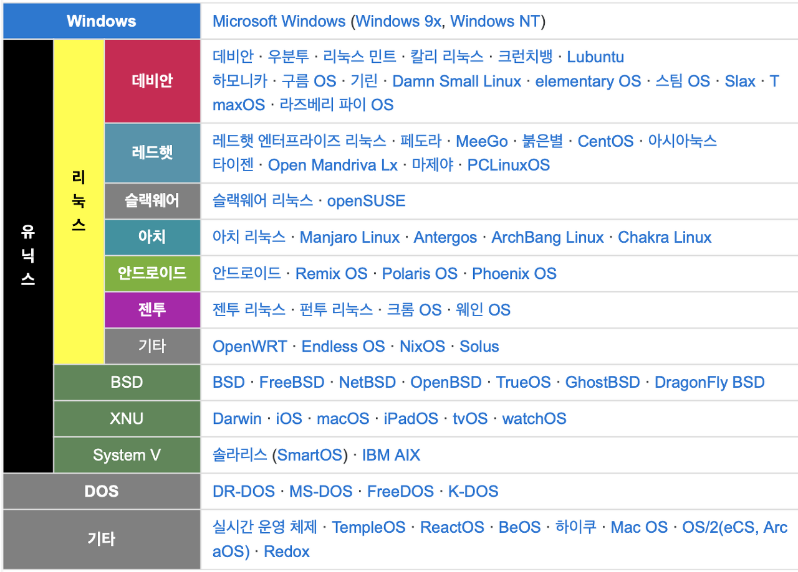
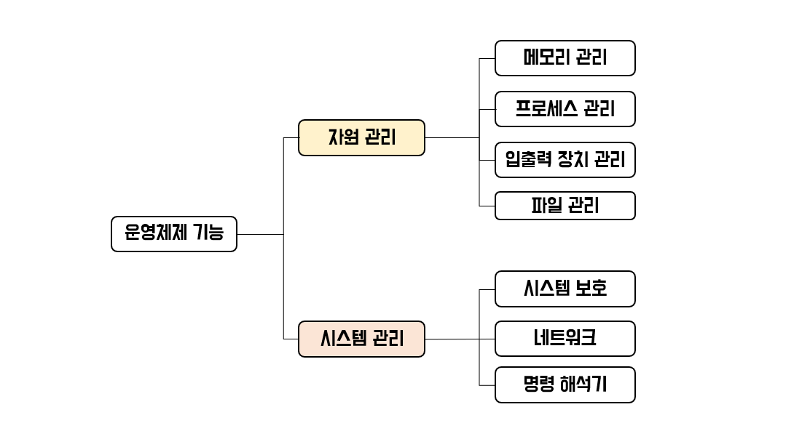

> 운영체제는 **시스템 자원을 관리**하여 사용자가 **하드웨어의 기능을 이용**하고 **응용프로그램을 실행**할 수 있도록 도와주는 **소프트웨어(또는 인터페이스)**

P.S. 운영체제를 구성하는 프로그램들 중 상시 메모리에 상주하는 것이 **커널(Kernel)**  

## 운영체제의 종류

## 운영체제의 목적

> 아래 목적들은 운영체제의 성능을 평가하는 기준이 된다.
> 

- **처리능력(Throughput)** : 일정 시간 내에 시스템이 처리하는 일의 양
- **반환시간(Turn Around Time)** : 시스템에 작업을 의뢰한 시간부터 처리가 완료될 때까지 걸린 시간
- **사용가능도(Availability)** : 시스템을 사용할 필요가 있을 때 즉시 사용 가능한 정도
- **신뢰도(Reliabilty)** : 시스템이 주어진 문제를 정확하게 해결하는 정도

## 운영체제의 기능

### 1. 메모리 관리

> 컴퓨터의 메모리는 크게 메인 메모리 + 보조 기억 장치로 구분할 수 있다. 먼저, 메인 메모리에 명령어가 있어야 프로세서가 명령어를 수행할 수 있기 때문에 프로그램을 저장할 공간을 확보해두어야 하고 이렇게 저장된 프로그램이 효율적으로 실행될 수 있도록 메모리도 적절히 사용해야한다. 간단히 다음과 같이 정리할 수 있다.
> 

- 메모리에 저장할 프로그램을 저장한다.
- 사용할 메모리 공간을 결정하고 어떤 프로그램이 사용하는지 확인한다.
- 메모리를 할당하고 회수하는 방법을 정한다.

P.S. 메모리는 물리적인 하드웨어이기때문에 공간의 한계가 있다. 이를 위해 보조기억장치(보조메모리)가 필요하다. 대부분의 프로그램들은 메인 메모리에 저장되기 전까지는 보조 기억장치에 저장된다. 메인 메모리와 동일하게 공간을 할당하고 삭제하는 기능을 운영체제가 한다.

### 2. 프로세스 관리

> 프로세스는 실행중인 프로그램으로 운영체제는 프로세스의 생성 부터 실행, 종료까지의 전 과정에 관여하게 된다. 구체적으로 아래의 기능을 수행한다.
> 

- 프로세스와 스레드를 스케쥴링한다
- 프로세스를 생성하고 제거한다
- 프로세스를 중지하고 재수행한다
- 프로세스 동기화 방법을 제공한다
- 프로세스 통신 방법을 제공한다
- 교착상태를 방지하는 방법을 제공한다.

### 3. 입출력 장치 관리

> 운영체제는 특수 장치 드라이브를 사용하여 입출력 장치와 상호작용한다. 따라서 장치 드라이버를 제공하여 특정 하드웨어와 서로 통신할 수 있는 인터페이스를 제공한다.
> 

- 특정 장치 드라이버를 제공한다
- 드라이버 인터페이스를 제공한다.

### 4. 파일 관리

> 우리가 사용하는 파일 탐색기를 살펴보면 디렉터리 형식으로 파일이 관리되고 있고 탐색기 내에서 파일 검색이 가능하고 파일 생성과 삭제까지 가능하다. 이러한 기능을 바로 운영체제가 제공하는 것이다.
> 

- 파일을 생성하고 삭제한다
- 디렉터리를 생성하고 삭제한다
- 비휘발성 장치에 파일을 저장한다

### 5. 시스템 보호

> 시스템 보호는 컴퓨터 자원을 보호하는 기능이다. 응용프로그램, 사용자 로부터 자원을 보호하기 위해 권한을 부여하기도 하고 데이터를 암호화하기도 한다. 또한 프로세스들은 동시에 실행되면서 서로의 data에 접근하지 못하도록 보호하기도 한다.
> 

### 6. 네트워크

> 프로세서가 통신을 할 때는 경로 설정, 접속 정책, 충돌, 보안 등을 고려해야하는데 이를 운영체제가 관리한다.
> 

### 7. 명령 해석기

> 명령 해석기는 운영체제의 중요한 프로그램이다. 사용자나 응용 프로그램으로부터 대화형의 명령어가 들어오면 이를 운영체제에 전달하는 인터페이스이다.
> 

## 운영체제의 관리 유형

### 1세대) 일괄처리 시스템

> 일괄 처리 시스템은 초기의 컴퓨터 시스템에서 사용된 형태로, 일정량 또는 일정 기간 동안 데이터를 모아서 한꺼번에 처리하는 방식
> 

1.  일괄처리를 위해 적절한 작업 제어 언어(Job Control Language)를 제공해야함
2.  컴퓨터 시스템을 효율적으로 사용할 수 있음
3.  반환시간(Turn Around Time)이 늦지만 하나의 작업이 모든 자원을 독점하므로 CPU 유휴 시간이 줄어듦

### 2세대) 다중 프로그래밍 시스템

> 다중 프로그래밍 시스템 (Multi-Programming System)은 하나의 CPU와 주기억장치를 이용하여 여러개의 프로그램을 동시에 처리하는 방식
> 

1.  하나의 주기억장치에 두개 이상의 프로그램을 기억시켜 놓고, 하나의 CPU와 대화 하면서 동시에 처리
2.  CPU의 사용률과 처리량이 증가

### 2세대) 시분할 시스템

> 시분할 시스템(Time Sharing System)은 여러 명의 사용자가 사용하는 시스템에서 컴퓨터가 사용자들의 프로그램을 번갈아가며 처리해줌으로써 각 사용자에게 독립된 컴퓨터를 사용하는 느낌을 줌
> 

1.  여러 사용자가 각자의 단말장치를 통하여 동시에 운영체제와 대화하면서 각자의 프로그램을 실행
2.  하나의 CPU는 같은 시점에서 여러 개의 작업을 동시에 수행할 수 없기 때문에, CPU의 전체 사용시간을 작은 작업 시간량으로 쪼개어 그 시간량 동안만 번갈아가면서 CPU를 할당하여 각 작업을 처리
3.  다중프로그래밍 방식과 결합하여 모든 작업이 동시에 진행되는 것처럼 대화식 처리가 가능
4.  시스템의 전체 효율은 좋아지나 개인별 사용자 입장에서는 반응 속도가 느려질 수 있음
5.  각 작업에 대한 응답 시간을 최소한으로 줄이는 것을 목적으로 하며, 하드웨어를 보다 능률적으로 사용할 수 있음

### 2세대) 다중처리 시스템

> 다중 처리 시스템(Multi-Processing System)은 여러개의 CPU와 하나의 주기억장치를 이용하여 여러 개의 프로그램을 동시에 처리하는 방식
> 
1.  하나의 CPU가 고장나더라도 다른 CPU를 이용하여 업무를 처리할 수 있으므로 시스템의 신뢰성과 안정성이 높음
2.  여러 CPU는 하나의 메모리를 공유하며 단일 운영체제에 의해 관리
3.  프로그램의 처리 속도는 빠르지만 기억장치, 입출력 장치 등의 자원 공유에 대한 문제점을 해결해야 함

### 2세대) 실시간 처리 시스템

> 실시간 처리 시스템(Real Time Processing System)은 데이터 발생 즉시, 또는 데이터 처리 요구가 있는 즉시 처리하여 결과를 산출하는 방식. 처리 시간이 단축되고, 처리 비용이 절감됩니다. 교통제어, 레이더 추적기, 은행의 온라인 업무 등 시간에 제한을 두고 수행되어야 하는 작업에 주로 사용됨
> 

### 3세대) 다중 모드 처리

> 다중 모드 처리(Multi- Mode Processing)은 일괄 처리 시스템, 시분할 시스템, 다중 처리 시스템, 실시간 처리 시스템을 한 시스템에서 모두 제공하는 방식
> 

### 4세대) 분산 처리 시스템

> 분산 처리 시스템(Distributed Processing System)은 여러개의 컴퓨터(프로세서)를 통신 회선으로 연결하여 하나의 작업을 처리하는 방식. 각 단말장치나 컴퓨터 시스템은 고유의 운영체제와 CPU, 메모리를 가지고 있음
>