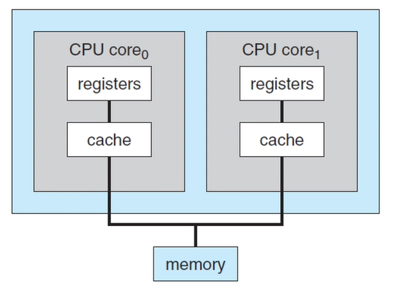
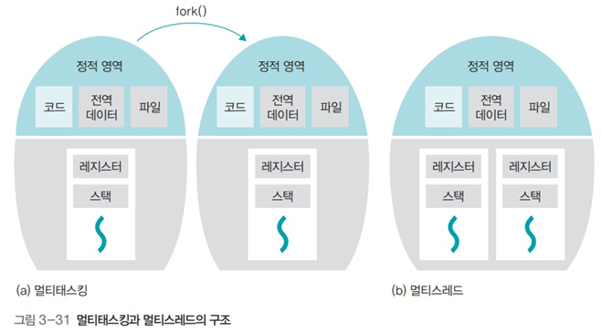
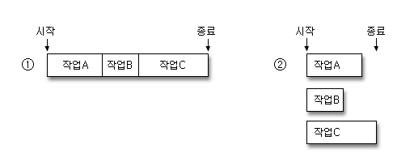

### 멀티 프로세스, 멀티 스레드를 왜 사용할까?

| 단일 프로세스 시스템 | - 한 번에 하나의 프로그램만 실행
- 단점 : CPU 사용률이 좋지 않음 |
| --- | --- |
| ↓ |  |
| 멀티 프로그래밍 | - 여러 개의 프로그램을 메모리에 올려놓고 동시에 실행시킴
- 단점 : 하나의 프로세스의 CPU 사용 시간이 길어지면 다른 프로세스는 계속 대기 |
| ↓ |  |
| 멀티 태스킹 | - 멀티 프로그래밍 + 시간을 아주 짧은 시간으로 쪼개서 프로세스들을 번갈아 가면서 실행 (→ 동시에 여러 프로그램이 실행되는 것처럼 느낌) |

- 멀티 태스킹의 한계
    - 하나의 프로세스가 동시에 여러 작업 수행 X → 여러 프로세스 만들어야 함
        - 프로세스의 컨텍스트 스위칭은 무거운 작업
        - 프로세스끼지 데이터 공유 까다로움
    - 듀얼 코어 등장 이후 활용 방법 필요
    
    → 멀티 프로세스, 멀티 스레딩
    

### 멀티 프로세스, 멀티 스레드

> 프로그래밍에서 함께 처리하기 위해 사용하는 기술
프로그램의 둘 이상의 부분을 동시에 실행하여 CPU를 최대한 활용
> 

### 멀티 프로세스

- 다수의 프로세스가 서로 협력적으로 일을 처리
- 둘 이상의 코어가 프로세스를 병렬로 분담해서 병행하여 실행
    - 병렬 처리 : 여러 작업을 동시에 실행
    - 병행 처리 : 하나의 코어가 여러 프로세스를 돌아가면서 조금씩 처리
- fork를 통해 프로세스를 다수 개로 늘려 여러 개의 프로그램들을 병렬로 처리

참고) 푸드트럭에의 비유

- 병렬 처리 : 푸드 트럭에 네 대의 로봇이 있다면, 각각의 로봇이 한 종류의 버거를 맡아서 요리
- 병행 처리 : 네 개의 버거를 두 대의 로봇이 만들 때 → 동시에 버거를 네 개 만드는 것처럼
    
    
    | 로봇1 | 빵 깔기 | 빵 깔기 | 패티 올리기 | 패티 올리기 |
    | --- | --- | --- | --- | --- |
    | 로봇2 |  | 야채 썰어 올리기 | 야채 썰어 올리기 |  |

### 멀티 스레드

- 하나의 프로세스 안에서 작업을 여러 스레드를 사용하여 동시에 처리
ex. 채팅 앱 : 사용자가 메시지 입력하는 도중에도 상대방이 새로운 메시지를 보냈는지 확인
- 하나의 프로그램 안에서 병렬 처리

참고) 푸드트럭에의 비유

- 한 개의 버거를 요리하는 작업이 하나의 프로세스일 때,
- 스레드 : 빵을 데우는 작업, 패티를 굽는 작업, 야채를 써는 작업
- 이를 병행 처리 : 빵 오븐에 → 패티 팬에 → 토마토 썰기 → 오븐에서 빵 꺼내기 → …

### 멀티 프로세스, 멀티 스레드의 활용

|  | 멀티 프로세스 | 멀티 스레드 |
| --- | --- | --- |
| 장점 | 하나의 프로세스에 문제가 생겨도 다른 프로세스에 문제가 생기지 않음 | 컨텍스트 스위칭할 때 공유하고 있는 메모리 만큼의 메모리 자원을 아낌
자원의 효율성 증가, 응답 속도 빨라짐 |
| 단점 | 컨텍스트 스위칭이 무거움 | 자원을 공유 → 스레드 하나가 프로세스 내 자원을 망치면 모든 프로세스가 종료됨, 동기화 문제 |
| 예시 | 크롬 : 하나의 프로세스에 멀티 스레드를 사용하는 인터넷 익스플로러와 달리 여러 개의 프로세스를 사용

- 크롬 : 하나의 화면에 문제 생겨도 다른 화면에 미치는 영향 적음 | 워드 프로세서 : 문서를 편집하면서 틀린 글자를 찾는 작업을 독립적인 스레드로 구현

- 익스플로러 : 하나의 화면에 문제 생겨서 강제 종료하면 익스플로러 전체가 종료됨 |

---

참고 자료

- 멀티 프로세스, 멀티 스레딩의 등장 : [https://www.youtube.com/watch?v=QmtYKZC0lMU](https://www.youtube.com/watch?v=QmtYKZC0lMU)
- 푸드트럭 비유 : [https://hongong.hanbit.co.kr/cpu가-멀티태스킹을-하는-방법-프로세스-vs-스레드/](https://hongong.hanbit.co.kr/cpu%EA%B0%80-%EB%A9%80%ED%8B%B0%ED%83%9C%EC%8A%A4%ED%82%B9%EC%9D%84-%ED%95%98%EB%8A%94-%EB%B0%A9%EB%B2%95-%ED%94%84%EB%A1%9C%EC%84%B8%EC%8A%A4-vs-%EC%8A%A4%EB%A0%88%EB%93%9C/)