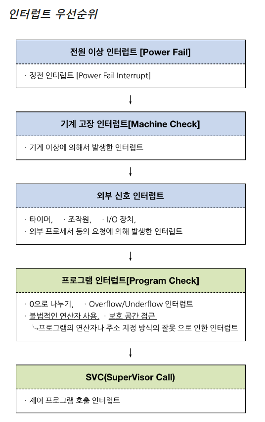
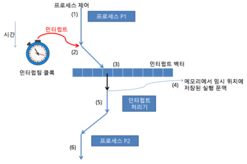
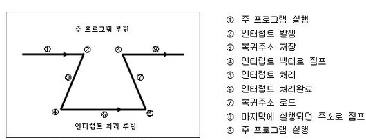

## 인터럽트란?

> CPU가 프로그램을 실행하는 도중 예기치 않은 상황이 발생할 때, 현재 실행 중인 작업을 즉시 중단하고 발생된 상황에 대해 우선적으로 처리가 필요함을 CPU에게 알리는 것
> 

i.e. 우선적으로 처리해야하는 일이 발생하였다면, 그것을 처리한 후 원래 작업으로 돌아옴

## 인터럽트의 종류

### 1. 하드웨어 인터럽트

- 가장 일반적인 인터럽트
- CPU외부에서 인터럽트 요구 신호에 의해 발생

1. 입출력 인터럽트(I/O interrupt)

ex. 입출력 작업의 종료나 입출력 오류에 의해 발생(키보드, 마우스, 프린터 등)

1. 정전, 전원 이상 인터럽트(Power fail interrupt)

ex. 전원 공급의 이상에 의해 발생

1. 기계 착오 인터럽트(Machine check interrupt)

- CPU의 기능적인 오류로 인해 발생
    
    
1. 외부 신호 인터럽트(External interrupt)

- I/O 장치가 아닌 오퍼레이터나 타이머에 의해 의도적으로 프로그램이 중단된 경우 발생
    
    

## 소프트웨어 인터럽트

> 프로그램의 오류에 의해 생기는 인터럽트
> 

e.g. trap 이나 exception 등..

- 0으로 나누는 경우
- OverFlow/UnderFlow
- 페이지 부재
- 부당한 기억장소의 참조
- 기타 등등..

### SVC(SuperVisor Call) interrupt

> 일반적으로 응용프로그램은 유저모드로 실행된다.
→ 유저가 접근할 수 없는 자원에 대해 superviosr 모드로 작업을 수행한 후 유저모드로 다시 변경하는 과정을 거친다.
> 

## 인터럽트의 우선순위

## 인터럽트 서비스 루틴 (ISR)

> 인터럽트가 접수되면 각각의 인터럽트에 대응하여 특정 기능을 처리하는 기계어 코드 루틴.
인터럽트 핸들러라고도 한다.
> 

## 인터럽트 벡터

> 여러 가지 인터럽트에 대해 해당 인터럽트 발생 시 처리해야할 ISR의 주소를 보관하는 공간
> 

- 대부분의 CPU들은 인터럽트 벡터 테이블을 가지고 있다.

## 인터럽트의 과정

